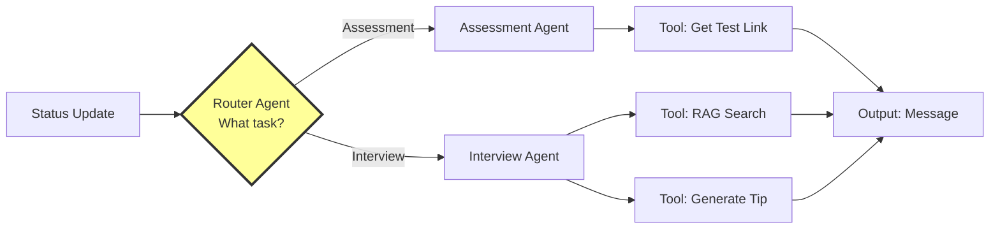

# RecruitEM - Smart Recruitment Dispatcher

A multi-agent orchestration system for recruitment automation. When a candidate's status changes, a router agent intelligently delegates tasks to specialist agents for assessment invitations or interview preparation.

## Architecture



### System Flow

1. **Router Agent**: Analyzes candidate status and routes to appropriate specialist
2. **Assessment Agent**: Handles test logistics, fetches test links, drafts invitations
3. **Interview Agent**: Provides coaching, uses RAG to find tips, generates personalized advice

## Project Structure

```
RecruitEM/
├── orchestrator.py      # Main implementation (~440 lines)
├── demo.py              # Quick demonstration script
├── test.py              # Automated test suite
├── requirements.txt     # Dependencies (optional)
├── README.md           # This file
└── .gitignore          # Git ignore rules
```

## Quick Start

### Run the Demo

```bash
python3 orchestrator.py
```

### Use as a Library

```python
from orchestrator import orchestrate

message = orchestrate(
    candidate_name="Ruru",
    candidate_email="ruru@email.com",
    status="Assessment",  # or "Interview"
    job_id="J123"
)

print(message)
```

## Key Features

- **Router-Based Orchestration**: Intelligent task delegation
- **Specialist Agents**: Domain-specific processing (Assessment/Interview)
- **Tool Integration**: Dynamic function calls (test links, RAG search, tip generation)
- **State Management**: Type-safe data flow through the pipeline
- **Observable Execution**: Real-time console output showing decision-making

## Code Structure

The `orchestrator.py` file is organized top-to-bottom:

1. **Data Section**: Test links and job descriptions (dicts)
2. **State Management**: TypedDict for type-safe state
3. **Tools**: Simple functions (get_test_link, rag_search, generate_prep_tip)
4. **Agents**: Router, Assessment, and Interview agents
5. **Orchestrator**: Main flow that wires everything together
6. **Demo**: Test cases showing the system in action

## Usage Example

```python
from orchestrator import orchestrate

# Assessment invitation
message = orchestrate(
    candidate_name="Asheesh",
    candidate_email="asheesh@example.com",
    status="Assessment",
    job_id="J123"
)

# Interview preparation (with optional Claude AI)
message = orchestrate(
    candidate_name="Shraddha",
    candidate_email="Sri@example.com",
    status="Interview",
    job_id="J456",
    use_claude=True  # Enable AI-powered tips
)
```

## Technology

- **Language**: Python 3.6+
- **Dependencies**: Zero required (Pure Python stdlib)
- **Optional**: Anthropic Claude API (for AI-powered interview tips)

## Design Approach

| Traditional | This Project |
|------------|--------------|
| 8+ files | 1 file |
| Complex frameworks | Plain functions |
| Hidden logic | Observable execution |
| 30 min setup | Instant run |

## Testing

### Quick Tests

```bash
# Quick demonstration
python3 demo.py

# Full demo with detailed output
python3 orchestrator.py

# Automated test suite
python3 test.py

# One-liner test
python3 -c "from orchestrator import orchestrate; print(orchestrate('Test', 'test@test.com', 'Assessment', 'J123'))"
```

### What the Tests Verify

- **Router Agent**: Correctly routes Assessment vs Interview status
- **Assessment Agent**: Generates messages with correct test links
- **Interview Agent**: Generates messages with prep tips
- **Tool Integration**: Tools are called correctly (get_test_link, rag_search)
- **State Management**: Data flows correctly through the pipeline

### For Demonstration

1. Run `python3 demo.py` - Shows both Assessment and Interview workflows
2. Run `python3 test.py` - Shows automated testing with verification
3. Open `orchestrator.py` - Walk through the code structure
4. Show customization - Edit job descriptions or test links to show flexibility

## Getting Started

1. **Run Demo**: `python3 orchestrator.py` - See it in action
2. **Run Tests**: `python3 test.py` - Verify functionality
3. **Read Code**: Open `orchestrator.py` - structured like a story
4. **Customize**: Edit job descriptions, test links, or message templates
5. **Extend**: Add new agents or tools following the existing patterns

## License

Educational implementation for learning multi-agent orchestration patterns.
