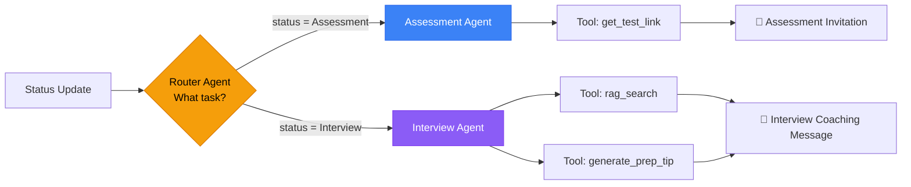

<div align="center">

# RecruitEM — Smart Recruitment Dispatcher

**A multi-agent orchestration system that routes candidate status updates to specialist AI agents — zero frameworks, pure Python.**

[](https://www.python.org/)
[](https://anthropic.com/)
[](LICENSE)
[]()

[**Demo**](#-quick-start) · [**Architecture**](#%EF%B8%8F-architecture) · [**Usage**](#-usage)

</div>

---

## 🧠 What Problem Does This Solve?

Recruitment teams handle two distinct workflows for every candidate status change:

- **Assessment stage** → find the right test link, send a professional invitation with instructions
- **Interview stage** → pull relevant job context, generate personalised preparation tips, send a coaching message

Traditionally this is manual — a recruiter copies a template, looks up the test link, and adds tips by hand. **RecruitEM automates the entire path** using a router-based multi-agent system: one agent decides *what* to do, two specialist agents handle *how* to do it.

> **Core insight:** Not every AI task needs a framework. Complex orchestration can be transparent, readable, and dependency-free.

---

## ✨ Features

| Feature | Detail |
|---|---|
| 🔀 **Intelligent Routing** | Router agent analyses candidate status and delegates to the correct specialist |
| 📋 **Assessment Agent** | Fetches role-specific test links, drafts timed invitation messages |
| 🎯 **Interview Agent** | RAG search over job descriptions + generates personalized prep tips |
| 🤖 **Optional Claude Integration** | Enable AI-powered tips with `use_claude=True` (requires Anthropic API key) |
| 🎨 **Observable Execution** | Colour-coded terminal output shows every decision and tool call in real time |
| ⚡ **Zero Dependencies** | Runs on Python stdlib alone — Claude is strictly optional |

---

## 🏗️ Architecture


```mermaid
graph LR
    A[Status Update] --> B{Router Agent<br/>What task?}
    B -->|status = Assessment| C[Assessment Agent]
    B -->|status = Interview| D[Interview Agent]

    C --> E[Tool: get_test_link]
    D --> F[Tool: rag_search]
    D --> G[Tool: generate_prep_tip]

    E --> H[📧 Assessment Invitation]
    F --> I[📧 Interview Coaching Message]
    G --> I

    style B fill:#f59e0b,stroke:#d97706,color:#000
    style C fill:#3b82f6,stroke:#2563eb,color:#fff
    style D fill:#8b5cf6,stroke:#7c3aed,color:#fff
```

### Agent Responsibilities

```
Status Update
      │
      ▼
┌──────────────────────────────────────────┐
│            Router Agent                   │
│  Reads: status = "Assessment"|"Interview" │
│  Decides: which specialist to delegate to │
└──────────────────────────────────────────┘
      │                        │
      ▼                        ▼
┌─────────────┐        ┌───────────────────┐
│ Assessment  │        │  Interview Agent  │
│   Agent     │        │                   │
│             │        │  1. rag_search()  │
│ get_test_   │        │     ↳ job desc    │
│ link(role)  │        │  2. gen_tip()     │
│             │        │     ↳ Claude/KB   │
│ → Invitation│        │  → Coaching msg   │
└─────────────┘        └───────────────────┘
```

### State Management

```python
class AgentState(TypedDict):
    job_id: str
    candidate_name: str
    candidate_email: str
    status: Literal["Assessment", "Interview"]
    job_title: str
    job_description: str
    output_message: str   # filled by specialist agent
    metadata: dict        # agent name, timestamps
```

Type-safe state flows through every agent — no global variables, no hidden side effects.

---

## 📂 Project Structure

```
RecruitEM/
├── orchestrator.py     # Everything: state, tools, agents, orchestrator (~440 lines)
├── demo.py             # Demonstrates both Assessment + Interview workflows
├── test.py             # Automated test suite verifying routing and output
├── requirements.txt    # Optional: anthropic (for Claude tips)
└── images/             # Demo screenshots
    ├── RecruitEM1.png  # Orchestrator console output
    └── RecruitEM2.png  # Sample messages
```

**Intentional design:** one file over many. Every concept is visible without jumping between modules.

---

## 🚀 Quick Start

```bash
git clone https://github.com/Arushi-Srivastava-16/RecruitEM.git
cd RecruitEM

# Run the demo (no setup needed)
python3 orchestrator.py
```

That's it. No environment setup, no API key required.

### Optional: Enable Claude AI Tips

```bash
pip install anthropic
export ANTHROPIC_API_KEY=sk-ant-...

python3 -c "
from orchestrator import orchestrate
msg = orchestrate('Alex', 'alex@example.com', 'Interview', 'J123', use_claude=True)
print(msg)
"
```

---

## 📖 Usage

### As a Library

```python
from orchestrator import orchestrate

# Assessment path
message = orchestrate(
    candidate_name="Sarah",
    candidate_email="sarah@example.com",
    status="Assessment",   # → routes to Assessment Agent
    job_id="J123"
)

# Interview path (with optional Claude tips)
message = orchestrate(
    candidate_name="David",
    candidate_email="david@example.com",
    status="Interview",    # → routes to Interview Agent
    job_id="J456",
    use_claude=True        # generates AI-powered tips
)

print(message)
```

### Demo Output

**Assessment path:**
```
→ Router: Analyzing status='Assessment'...
   ✓ Decision: Route to ASSESSMENT AGENT (test logistics)
→ Assessment Agent: Processing for Sarah...
   → Tool: get_test_link('Python Developer') → https://assess.example.com/python
   ✓ Message drafted: 312 characters
```

**Interview path:**
```
→ Router: Analyzing status='Interview'...
   ✓ Decision: Route to INTERVIEW AGENT (prep coaching)
→ Interview Agent: Processing for David...
   → Tool: rag_search('J456')
      → Found JD: Data Analyst: SQL, Tableau, Python...
   → Tool: generate_prep_tip(use_claude=False)
   ✓ Message drafted: 487 characters
```

---

## 🧪 Testing

```bash
# Full demonstration
python3 demo.py

# Automated test suite
python3 test.py
```

Tests verify:
- Router correctly maps `Assessment` → Assessment Agent and `Interview` → Interview Agent
- Assessment Agent produces messages with the correct test link for each role
- Interview Agent produces messages with prep tips
- Tool calls (`get_test_link`, `rag_search`) return expected values
- State propagates correctly end-to-end

---

## 🔧 Extending the System

### Add a New Job Role

```python
# In orchestrator.py → TEST_LINKS dict
TEST_LINKS["ML Engineer"] = "https://assess.example.com/ml"

# In JOB_DESCRIPTIONS dict
JOB_DESCRIPTIONS["J999"] = {
    "title": "ML Engineer",
    "description": "ML Engineer role requiring PyTorch, model training, MLOps..."
}
```

### Add a New Agent

```python
def offer_agent(state: AgentState) -> AgentState:
    """Handles offer letter generation."""
    # ... generate offer letter
    state["output_message"] = offer_letter
    return state

# In router_agent():
if status.lower() == "offer":
    return "offer"

# In orchestrate():
elif next_agent == "offer":
    state = offer_agent(state)
```

---

## 🔬 Design Decisions

| Decision | Why |
|---|---|
| **Single file** | Every concept is visible at once — easier to read, demo, and explain |
| **TypedDict state** | Type-safe data flow without a framework; self-documenting |
| **Rule-based router** | Simple status strings don't need LLM routing — predictable and fast |
| **Fallback tip generation** | Keyword matching in tips DB when Claude key isn't present |
| **Coloured terminal output** | Makes tool calls, decisions, and agent handoffs visually distinct during demos |

---

## 🔬 Tech Stack

| Component | Technology |
|---|---|
| **Language** | Python 3.6+ |
| **Required Dependencies** | None (Python stdlib only) |
| **Optional** | `anthropic` — Claude API for AI-powered interview tips |
| **Pattern** | Router Agent → Specialist Agents → Tool Calls |

---

## 📄 License

MIT License

---

<div align="center">
  <sub>Multi-agent orchestration · Zero dependencies · Observable execution</sub>
</div>
